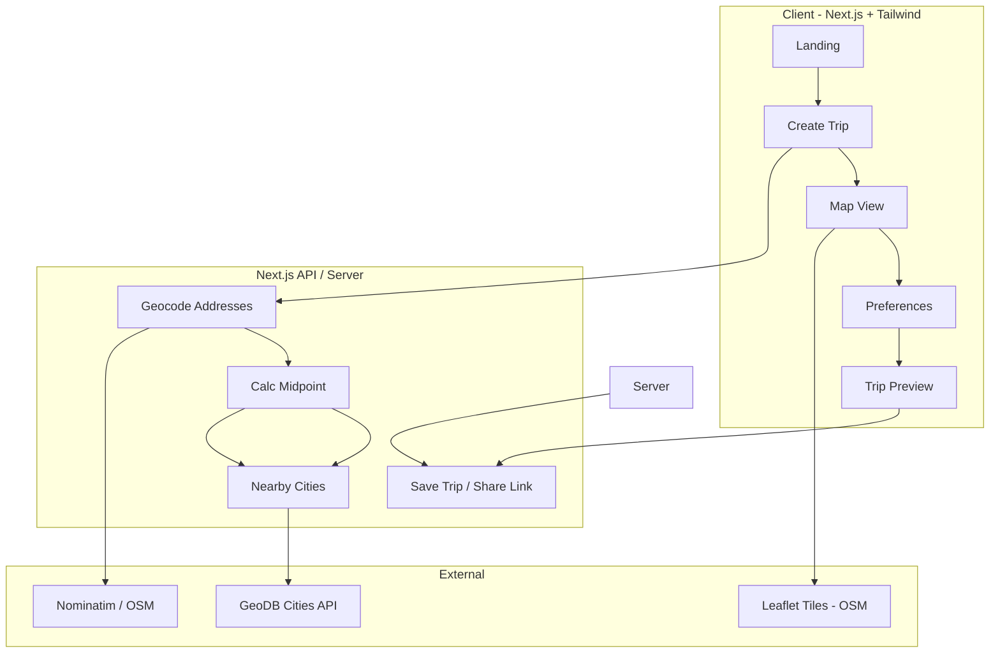

# Tech Stack and Architecture – Weekend Trip Planner MVP

## Tech Stack (short, ship-ready)

| Layer | Choice | Why |
|-------|--------|-----|
| **Framework** | Next.js 14 (App Router) | SSR/SSG, API routes, Vercel-native deploy |
| **Styling** | Tailwind CSS | Fast UI, card-based layout, no extra design system |
| **Map** | Leaflet + react-leaflet | Free, no API key for base tiles; simple markers |
| **Geocoding** | Nominatim (OpenStreetMap) or browser Geolocation | Free; turn addresses into lat/lon for start points |
| **Midpoint** | In-app (Haversine / centroid) | No external service; avg lat/lon or weighted centroid |
| **Nearby cities** | GeoDB Cities API (free tier) or static EU/country JSON | "Cities within radius" around midpoint |
| **Shareable trips** | URL slug + in-memory or serverless store (e.g. Vercel KV or JSON file) | No auth; id in path, e.g. `/trip/[id]` |
| **Hosting** | Vercel | One-click from repo; fits Next.js |

**Not in MVP:** Auth, DB, calendar, real booking — stubbed or UI-only per [MVP.md](MVP.md).

---

## Architecture Diagram

**Data flow (simplified):**

1. **Create Trip** – User enters N start addresses → API calls Nominatim for lat/lon.
2. **Midpoint** – Server computes geographic centroid (or Haversine midpoint) from those coordinates.
3. **Nearby cities** – API calls GeoDB (or similar) with midpoint + 50 km radius → list of cities.
4. **Map view** – Client receives start points, midpoint, and city list; Leaflet shows markers + OSM tiles.
5. **Trip preview** – Server generates shareable id, stores minimal trip payload (e.g. Vercel KV or serverless store); client shows `/trip/[id]` with same map + summary cards.

---

## Suggested Repo Structure (minimal)

- `app/` – App Router: `page.tsx` (landing), `dashboard/`, `create/`, `trip/[id]/`, `api/` (geocode, midpoint, cities, save-trip).
- `components/` – Map (Leaflet wrapper), LocationInput, TripCard, TripPreview.
- `lib/` – Geocoding client, midpoint util, cities API client, trip store (e.g. KV or in-memory for MVP).
- Tailwind + Leaflet CSS/JS only; no heavy UI framework.

---

## Out of Scope for MVP (per docs)

- User system, calendar, advanced filters: stubbed or visual only.
- Real accommodation/restaurant data: optional dummy data or placeholders.

This keeps the stack small and the architecture flat (one Next.js app, a few API routes, two external APIs) so you can ship the MVP quickly on Vercel with Next.js and Tailwind.
